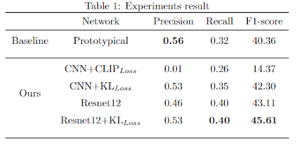

# An improved version of Few-shot Bioacoustic Event Detection (DCASE 2021 Task 5)
In the final project of Tsinghua Deep Learning 2022 spring course, we proposed a new kl-loss function for Few-shot Bioacoustic Event Detection (Task 5 in the DCASE Challenge 2022). This repository contains the source code to run the evaluation metrics, and the baseline systems, along with a detailed description of the task. 

# Result Reproduce
**Program running steps:** 

**first step**
**download the developement set mentioned by dcase2021 task 5 and hable the directories in config.yaml file(make sure you do this steps before anything)**

Execute the following command line in the directory /home/wft/DCASE2021Task5/src/: Run the following command line in the directory:
 1. CUDA_VISIBLE_DEVICES=9 python main.py set.features=true
 2. CUDA_VISIBLE_DEVICES=9 python main.py set.train=true
 3. CUDA_VISIBLE_DEVICES=9 python main.py set.eval=true-----? This step generates the Eval_out_tim.csv file to be used in the next step. Also use the weight file in the pre_best/ directory: model_best.pth.tar

 4. Command template: python post_proc.py -val_path=/home/wft/dcaseTask5_with_40_f_measure/Development_Set/Validation_Set/ -evaluation_file=eval_output.csv -new_evaluation_file=new_eval_output.csv
     Specific command line: CUDA_VISIBLE_DEVICES=9 python post_proc.py -val_path=/home/wft/dcaseTask5_with_40_f_measure/Development_Set/Validation_Set/ -evaluation_file=Eval_out_tim.csv -new_evaluation_file=Eval_out_tim_new.csv
     Copy the generated file Eval_out_new.csv to Eval_out_new.csv in steps 4/5 below for evaluation.

Execute the following command line in the directory /home/wft/DCASE2021Task5/evaluation_metrics/:

 5. Command template: python evaluation.py -pred_file=baseline_template_val_predictions.csv -ref_files_path=./Development_Set/Validation_Set/ -team_name=TESTteam -dataset=VAL -savepath=./
      Specific command line: CUDA_VISIBLE_DEVICES=9 python evaluation.py -pred_file=/home/wft/DCASE2021Task5/src/Eval_out_tim_new.csv -ref_files_path=/home/wft/dcaseTask5_with_40_f_measure/Development_Set/Validation_Set/ -team_name=TESTteam -dataset=VAL -savepath =./dict/

Steps of using the pretrined model to reproduce our results.
1. CUDA_VISIBLE_DEVICES=9 python main.py set.eval=true-----? This step generates the Eval_out_tim.csv file to be used in the next step. Also use the weight file in the pre_best/ directory: model_best.pth
2. python post_proc.py -val_path=/home/wft/dcaseTask5_with_40_f_measure/Development_Set/Validation_Set/ -evaluation_file=eval_output.csv -new_evaluation_file=new_eval_output.csv
3. python evaluation.py -pred_file=baseline_template_val_predictions.csv -ref_files_path=./Development_Set/Validation_Set/ -team_name=TESTteam -dataset=VAL -savepath=./

# Ours Results

**For more info, please refer to our pdf documentation, thank you.**